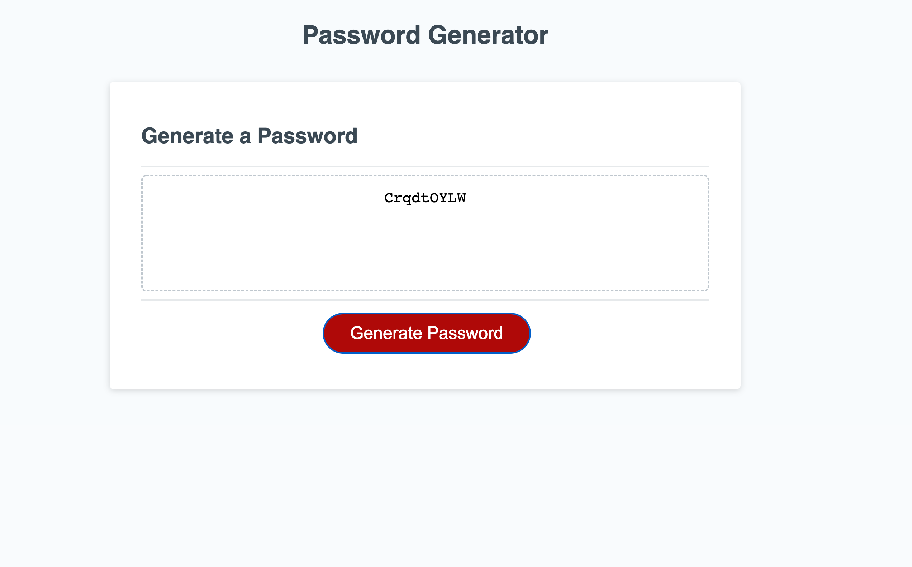

# Password-Generator

https://akaiafas526.github.io/Password-Generator/

https://github.com/Akaiafas526/Password-Generator

STEPS:

When page is opened prompts appear to let user know of password criteria.

User must choose length of characters they would like to have in password

User will than be prompted with character choices.

Choices include special characters, numbers and Uppercase or Lowercase letters.

Once user makes their choices the window prompt will dissapear.

User must choose criteria before password will generate.

User must than click generate password button to generate password according to the criteria chosen by user.